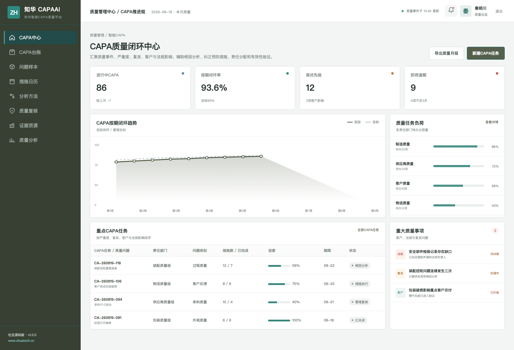
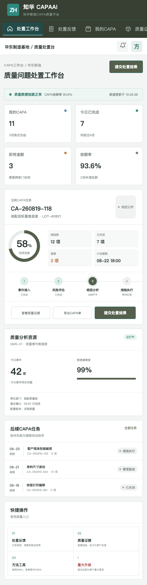

# Zhuatech CAPA AI｜知华智能质量闭环社区版

质量问题只有完成“发现—遏制—根因—纠正—预防—验证”，才算真正关闭。本项目由[知华科技（上海如静知华信息科技有限公司）](https://www.zhuatech.cn/)维护，Java 工程包名为 `cn.zhuatech.capaai`。



## 社区版能力地图

`质量事件 → 严重度/发生度/探测度 → 客户与法规影响 → 根因证据 → CAPA 措施 → 有效性验证`

- 使用严重度、发生度、探测度、复发次数和根因置信度生成优先级；
- 高优先级事件触发临时遏制、质量经理审批与更短的目标关闭期限；
- 支持 5Why、鱼骨图、FMEA、8D 等方法的证据化记录；
- 管理端提供复发、逾期、责任部门和按期闭环趋势；
- 移动工作台支持现场反馈、质量证据和重大问题升级。



## 工程说明

后端：Java 21、Spring Boot、JWT、JPA、Flyway、MySQL 8；前端：Vue 3、Vite、Pinia；支持 Docker Compose、H2 测试与健康检查。

```bash
docker compose up --build
```

浏览器打开 `http://localhost:5173`，使用 `admin / Demo@2026` 或 `operator / Demo@2026`。核心接口：`POST /api/ai/capa/assess`；参见 [API](docs/api.md)、[数据库](docs/database.md)和[部署](deploy/README.md)。

## 授权与联系

本工程仅供个人非商业学习、研究和交流，**不得商用**。企业生产部署、内部使用、SaaS、实施交付、收费服务、品牌替换或商业再发行，须取得上海如静知华信息科技有限公司书面授权，详见 [LICENSE](LICENSE)。

质量管理、QMS/MES 集成、AI 私有化、OPC 技术支持、软件外包与定制开发，请访问[知华科技官网](https://www.zhuatech.cn/)或扫码咨询：

| 微信咨询一 | 微信咨询二 |
| --- | --- |
|  |  |

Copyright © 2026 上海如静知华信息科技有限公司
